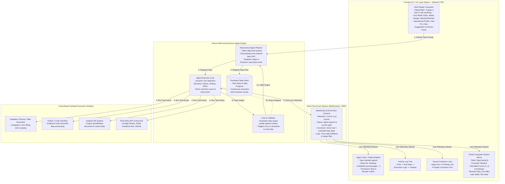

# Manus AI Autonomous AI Agent — System Architecture & Design Specification

This document details the architecture, design, and execution backend for the Manus AI Autonomous AI Agent Application integrated within Hanna.

---

## High-Level System Architecture Diagram

---

## Core System Architectural Pillars

### 1. FRONTEND UI/UX DESIGN & INTERACTIVE ELEMENTS

#### A. The "Task Design" Composer
- **Assignment-Centric Design**: Moves away from open-ended conversational chatbots toward task-driven agent delegation.
- **Explicit Placeholder**: Directs user with `"Assign a task or ask anything..."`.
- **Arm Mode Chips**: Contextual attachment tags (`Slides`, `Design`, `Meeting Minutes`, `Market Research`, `Code Analysis`) that attach specific system directives and context presets.
- **Operational Profile Selector**:
  - **Lite**: Fast execution, lightweight tool calls.
  - **Pro**: Standard agentic reasoning, web search, code interpreter.
  - **Max**: Multi-agent consensus, heavy code execution, deep web crawling, multi-step critique.
- **Suggested Connector Cards**: Pre-configured integration cards beneath the composer combining connector branding (e.g., Google Sheets, Facebook Ads, Stripe, Web Browser) with concrete, actionable task outcomes (e.g., *"Analyze ad campaign ROI and export performance spreadsheet"*).

#### B. Real-Time Task Execution & Visual Connectors
- **Activity Log Tree**: Hierarchical step visualization displaying the primary goal, sub-task breakdowns, active tool invocations, duration timers, and output artifacts.
- **Visual Connector Loop**: A live visual loop component rendering `Agent Icon -> Pulsing Animated Connection Line -> Active Integration Icon` (e.g., Chrome, Python, Google Sheets, Stripe).

#### C. The "Virtual Computer Screen" Mirror
- **Viewport Frame**: Titled `"[App Name]'s Computer Window"` with browser/editor tab navigation (Browser, Code Sandbox, Terminal, File Workspace).
- **Live Cursor Telemetry**: Renders an animated cursor moving smoothly across `(x, y)` pixel coordinates to simulate active form filling, link clicking, and text selection.
- **Sandboxed Directory Viewer**: Shows live files written by the agent in real time.

#### D. The Agent's Voice / Status Bubble
- **Task-Oriented Speech**: Omits conversational filler to focus purely on active progress and goals (e.g., `"Step 2/4: Reading competitor pricing pages..."`).
- **Skip to Results**: Action button allowing users to immediately scroll/jump to the finalized product.

---

## 2. BACKEND WORKFLOW & EXECUTION ENGINE

#### A. Cloud-Based Sandbox & Persistence
- Execution runs completely server-side in isolated containerized sandboxes.
- **Browser Independence**: Execution persists asynchronously. If the user disconnects or closes their device, server-side workers maintain task state until completion.

#### B. Multi-Agent Planner, Executor, and Critic Loop
1. **Planner**: Takes the initial goal, decomposes it into sequential or parallel step definitions, and persists them.
2. **Executor**: Executes each step sequentially using available sandbox tools (Headless Web Browser, Code Interpreter, Sandboxed FS, External Connectors).
3. **Critic/Validator**: Cross-references tool output against step validation criteria before approving advancement to the next step.

#### C. Live Progress WebSockets & Telemetry Stream
- WebSocket server streams JSON event frames to the frontend including:
  - `cursor`: `{ x, y, action, target }`
  - `step`: `{ id, label, status, duration }`
  - `connector`: `{ name, icon, status }`
  - `speech`: `current task status text`
  - `log`: `terminal output / file write event`
